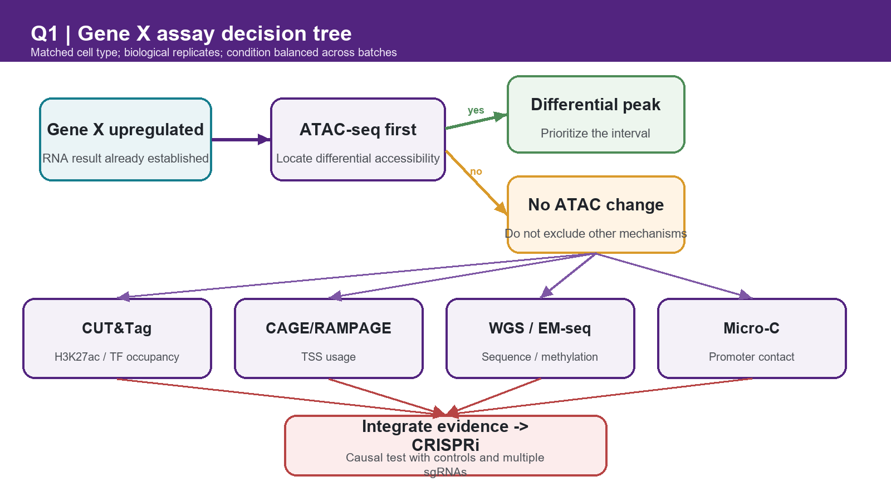
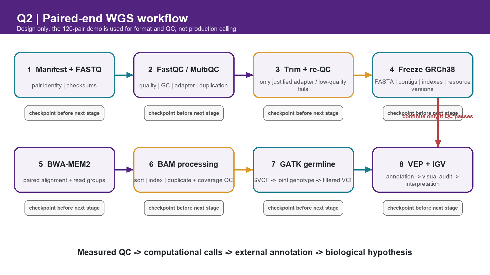
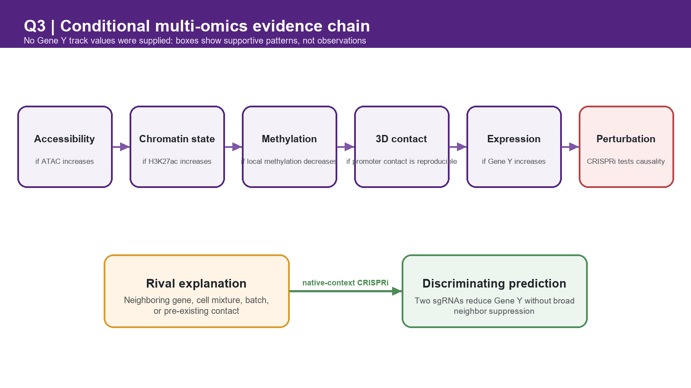
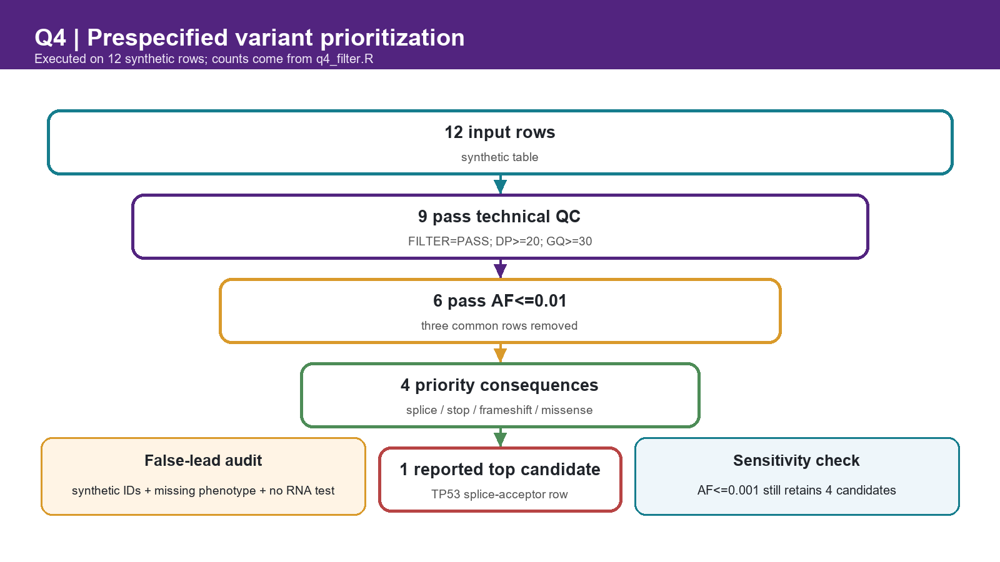

# Week 4 Homework Report

**Name:** 雷嘉莉  
**Student ID:** SUAT24000139  
**Date:** 17 September 2026  
**Course:** Bioinformatics: From Multi-Omics Data to Discovery  

> **Data boundary.** The supplied FASTQ, QC summary, sample manifest, coordinates, allele frequencies, and ClinVar-style fields are synthetic teaching data. They are not patient findings and are not used for clinical conclusions.

---

## Question 1 - Choose the Right Genomic Assay (25 pts)

### 1. Reasoning before AI

I would begin with ATAC-seq because differential chromatin accessibility can efficiently identify candidate regulatory regions associated with Gene X upregulation. Comparing the same cell type from disease and control groups, with independent biological replicates distributed across matched processing batches, would narrow the genomic search space for subsequent TF/histone profiling, sequence analysis, and functional validation. Accessibility alone cannot prove TF occupancy, enhancer activity, three-dimensional contact, or causality.

### 2. AI-assisted workflow

I asked AI to critique an ATAC-first strategy, identify claims that were too strong, and turn the assay list into a decision tree rather than an unconditional checklist. I accepted the correction that open chromatin is not an absolute prerequisite for every TF interaction or chromatin contact. The retained workflow is:

`RNA upregulation already established -> ATAC-seq -> H3K27ac/TF CUT&Tag -> CAGE/RAMPAGE -> WGS or EM-seq -> Micro-C -> CRISPRi`

The downstream branches depend on the preceding evidence. A negative ATAC result would redirect attention toward sequence variation, methylation, promoter usage, cell-composition effects, or distal regulation rather than ending the investigation.

### 3. Verification

The original ATAC-seq paper describes a transposase-based assay for accessible chromatin and nucleosome positioning, supporting its use as an accessibility screen but not as a direct causal test [1]. The CUT&Tag method profiles antibody-bound chromatin proteins or histone modifications in situ, supporting its use for H3K27ac or TF follow-up [2]. CRISPR interference has been used to map functional enhancer-promoter connections, supporting perturbation as a stronger causal test than co-occurring epigenomic signals [3].

| Assay | Measures | Cannot prove alone | Role in the strategy |
|---|---|---|---|
| ATAC-seq | Accessible chromatin and fragment pattern | TF identity, enhancer activity, or causality | First-pass localization of differential regulatory regions |
| H3K27ac/TF CUT&Tag | Histone mark or antibody-targeted protein occupancy | Functional regulation of Gene X | Tests active state or candidate TF occupancy |
| CAGE/RAMPAGE | Capped 5-prime RNA ends and TSS usage | Distal enhancer causality | Checks promoter and alternative-TSS activity |
| WGS | Sequence variants across the genome | Regulatory activity | Finds candidate cis-regulatory sequence changes |
| EM-seq/WGBS | Cytosine methylation | Whether methylation caused expression change | Tests an epigenetic mechanism at candidate regions |
| Micro-C/Hi-C | Population-average chromatin contacts | Productive or causal enhancer action | Tests physical proximity to the Gene X promoter |
| CRISPRi | Expression response after targeted repression | Exact molecular mechanism without follow-up | Final native-context causal test |

### 4. Final conclusion

ATAC-seq is my first assay because it provides a genome-wide, coordinate-resolved screen for regulatory regions whose accessibility differs between matched disease and control samples. A disease-enriched ATAC peak near Gene X would prioritize that interval, but it would remain an association: accessibility does not identify the responsible TF, establish enhancer activity, or show that the region contacts Gene X. H3K27ac or TF-directed CUT&Tag would test whether the interval carries an active chromatin state or candidate factor occupancy. CAGE/RAMPAGE would determine whether Gene X uses a different transcription start site. WGS and EM-seq/WGBS would test sequence and methylation mechanisms, while Micro-C would ask whether the interval physically contacts the promoter. Each layer should be measured in the same cell type with biological replication, randomized processing, and disease/control samples balanced across batches; technical replicates are not independent biological units. Concordant evidence would motivate CRISPRi with multiple sgRNAs and appropriate controls. If ATAC-seq shows no difference, sequence variants, methylation, pre-existing chromatin contacts, cellular composition, and post-transcriptional mechanisms remain viable alternatives. Thus the workflow narrows hypotheses without treating any descriptive assay as proof.

> **The biological question chooses the assay because each method measures a different candidate mechanism, while only targeted perturbation can directly test whether a candidate regulatory element contributes to Gene X expression.**

---

## Question 2 - From FASTQ to a Trustworthy Analysis Workflow (25 pts)

### 1. Reasoning before AI

I chose paired-end human WGS because S01 is the only sample with supplied FASTQ files. My workflow begins with read-level QC, preserves sample and mate identity, fixes a reference assembly before alignment, and creates explicit checkpoints between FASTQ, BAM, VCF, annotation, visualization, and interpretation. I directly inspected both compressed FASTQ files with `q2_fastq_inspect.py`. The 120-pair demo is sufficient for format/QC teaching but not for production alignment, variant calling, or biological inference.

### 2. AI-assisted workflow

I used a plan-first prompt that required purpose, input, output, checkpoint, assumption, and documentation for every stage, and prohibited code or claims of execution in the first response. After reviewing the plan, I retained this workflow:

| Stage | Purpose | Output/checkpoint |
|---|---|---|
| 1. Manifest and FASTQ validation | Confirm sample IDs, R1/R2 pairing, compression, and checksums | Validated manifest and immutable raw FASTQ records |
| 2. FastQC/MultiQC | Detect quality, GC, adapter, duplication, and sequence-content problems | QC report; documented accept/trim/reject decision |
| 3. Adapter/quality trimming | Remove demonstrated adapter and low-quality tails; avoid unnecessary trimming | Trimmed FASTQ plus repeat QC |
| 4. Reference selection | Freeze GRCh38 assembly, contigs, decoys, and matching resource versions | Reference FASTA, indexes, dictionary, and version record |
| 5. Alignment | Map paired reads with read-group metadata | SAM/BAM; mapped-pair and insert-size checks |
| 6. BAM processing | Coordinate-sort, index, mark duplicates, and assess coverage/contamination | Analysis-ready BAM/BAI and QC metrics |
| 7. Germline calling/filtering | Generate per-sample GVCF, joint-genotype a cohort, and filter appropriately | Filtered VCF plus decision log |
| 8. Annotation/visualization | Add transcript/population/clinical context and inspect selected loci | Versioned VEP output and IGV screenshots |
| 9. Interpretation | Separate call quality, annotation, and biological hypothesis | Reproducible evidence table and limitations |

The complete plan-first prompt is preserved in `ai_verification_record.md`.

### 3. Verification

FastQC is an official modular QC tool for FASTQ/SAM/BAM inputs [5]. The reference is recorded as **GRCh38.p14** for assembly identity, while chromosome-coordinate compatibility must be maintained across all resources [4]. BWA-MEM2 documents paired-end input as `mem reference R1 R2` [6]. The GATK germline workflow separates per-sample GVCF generation from cohort genotyping and notes that cohort context improves discovery [7]. Ensembl VEP release 116 documentation supports VCF/GRCh38 input and records cache/API metadata in output headers [8]. Documentation was accessed on 17 September 2026; an actual run must additionally record installed tool versions and checksums.

**Direct FASTQ inspection**

I ran the dependency-free script `q2_fastq_inspect.py` on the supplied R1/R2 files and retained the exact output in `results/q2_fastq_inspection.tsv`.

| Metric | R1 result | R2 result | Operational definition |
|---|---:|---:|---|
| Read count | 120 | 120 | Direct FASTQ record count |
| Sequence length | 80-80 bp | 80-80 bp | Observed minimum-maximum |
| Matched pair IDs | 120/120 | 120/120 | Names match after removing the final `:1` or `:2` |
| Reads containing adapter | 18 (15.0%) | 18 (15.0%) | Exact `AGATCGGAAGAGC` match |
| High-GC reads | 12 (10.0%) | 0 (0.0%) | GC fraction at least 70% |
| Exact duplicate observations | 34 (28.3%) | 0 (0.0%) | Read count minus unique sequence count |
| Largest identical-sequence group | 18 (15.0%) | 1 (0.8%) | Exact sequence identity within each mate file |
| Low late-cycle quality | 18 (15.0%) | 18 (15.0%) | Mean Phred at most 15 from cycle 51 onward |

These measurements independently confirm 120 correctly named pairs of uniform 80-bp reads and reproduce the planted adapter, R1 high-GC, and R1 duplication signals. Two distinctions prevent misleading summaries. First, the largest single repeated R1 sequence accounts for 15.0%, but all exact duplicate observations together account for 28.3%; these are different quantities. Second, direct inspection identifies low late-cycle quality in both mates, while the supplied snapshot mentions the warning only for R1. I retain the direct measurements and report both discrepancies rather than forcing agreement. This small script is a targeted integrity/QC check, not a substitute for FastQC or a production WGS pipeline.

**Supplied FastQC-style snapshot interpretation**

| Metric | Supplied observation | Interpretation and decision |
|---|---|---|
| Per-base quality | WARN; median Phred about 12 after cycle 50 in about 15% of R1 | A subset has a severe late-cycle quality drop; trim only after inspecting profiles, then repeat QC |
| Per-sequence GC | WARN; main mode about 41% with a shoulder near 78% | The high-GC minority is compatible with the planted contaminant spike; investigate composition rather than assuming normal WGS variation |
| Adapter content | FAIL; adapter rises at the 3-prime end in about 15% of pairs | Trim the identified adapter and confirm its removal by repeat FastQC |
| Duplication | WARN; one template repeated in about 15% of R1 | In WGS this suggests PCR/low-complexity duplication; mark duplicates and review library complexity |
| Overrepresented sequences | FAIL; adapter fragment among top kmers | Consistent with the adapter module and supports targeted trimming |
| Per-base N content | PASS; approximately 0% N | No N-content failure is evident |
| Length distribution | PASS; all reads are 80 bp | Uniform length matches the synthetic design, not a claim about production WGS |

**AI-audit table**

| AI recommendation | My verification | Final decision |
|---|---|---|
| Run a standard full WGS pipeline | The assignment says full alignment is not required and the demo has only 120 pairs | Reject production execution; run only the focused FASTQ integrity/QC inspection |
| Trim adapters and low-quality tails | Two supplied modules independently flag the 3-prime adapter/quality problem | Retain, followed by repeat QC; do not trim blindly by a fixed length |
| Use GRCh38 | NCBI GRC identifies GRCh38.p14 and stable chromosome coordinates [4] | Retain and record the exact FASTA/accession/resource bundle |
| Align paired reads with BWA-MEM2 | Official README accepts separate R1 and R2 inputs [6] | Retain; add read groups and verify pairing/mapping metrics |
| Treat ClinVar annotation as a final diagnosis | ClinVar aggregates submitted classifications and review status [9] | Reject; preserve condition, date, submitter agreement, and review status |

### 4. Final conclusion

This is a reproducible workflow design with a completed raw-FASTQ integrity/QC check, not a completed human-genome analysis. Direct inspection confirms 120 correctly paired 80-bp reads and quantifies the adapter, high-GC, exact-duplication, and late-cycle quality signals. It also shows why a 15.0% largest duplicate group must not be reported as the 28.3% overall exact-duplicate fraction. The supplied snapshot additionally reports zero N content. These observations justify adapter-aware trimming, cautious quality filtering, and repeat QC. They do not justify reporting mapping rates or variants because no production alignment or calling was run. Every later stage must preserve assembly consistency, sample identity, read groups, tool/resource versions, and intermediate QC. Results should remain separated into directly measured quantities, supplied snapshot modules, computational calls, external annotations, and biological hypotheses.

> **The analyst, not the AI, is responsible for verifying inputs, reference compatibility, software and parameter choices, QC failures, variant evidence, and the limits of every biological conclusion.**

---

## Question 3 - Integrate Multi-Omics Evidence into a Regulatory Hypothesis (25 pts)

### 1. Reasoning before AI

I would interpret each layer independently before integrating it. Because no numerical Gene Y tracks were supplied, I will not write hypothetical peaks or expression changes as observations. Instead, I define the supportive pattern that would be required for an enhancer hypothesis and the evidence that would still be missing.

### 2. AI-assisted workflow

I asked AI to classify every statement as direct observation, interpretation, or missing evidence, and to generate a rival explanation before proposing a causal test. I retained CRISPRi because it perturbs the candidate region in its native chromatin context, but added multiple sgRNAs, a non-targeting control, a promoter-targeting positive control, a dCas9-KRAB control, and neighboring-gene measurements.

### 3. Verification

ATAC-seq measures accessibility rather than enhancer function [1]; H3K27ac-directed CUT&Tag profiles a chromatin mark rather than target-gene causality [2]; and CRISPRi enhancer perturbation can directly test functional enhancer-promoter connections [3]. The distinction between correlation and perturbation therefore survived verification. Processing order should be randomized or blocked so condition is not confounded with sequencing batch, and biological samples rather than repeated measurements are the experimental units.

| Layer | Direct observation available here | Supportive interpretation if observed | Missing evidence |
|---|---|---|---|
| ATAC-seq | No track values supplied | Greater accessibility at the candidate interval would support regulatory competence | TF identity and functional activity |
| H3K27ac | No enrichment values supplied | Condition-specific H3K27ac would support an active enhancer-like state | Whether the element regulates Gene Y |
| DNA methylation | No methylation proportions supplied | Lower methylation could be compatible with a permissive state | Direction, timing, and causal role |
| Hi-C/Micro-C | No contact matrix supplied | Reproducible contact with the Gene Y promoter would support physical proximity | Productive, specific, or causal contact |
| RNA-seq | No expression values supplied | Covariation with Gene Y would support association | Cell-composition effects and causal direction |

### 4. Final conclusion

A plausible supportive pattern would combine increased accessibility, H3K27ac enrichment, reduced local methylation, reproducible contact with the Gene Y promoter, and increased Gene Y expression in the same biological condition. These layers would be mutually consistent with an active enhancer, but none is provided numerically in this exercise and none alone demonstrates causality. A rival explanation is that the interval regulates another nearby gene, while its apparent association with Gene Y arises from shared cell state, cell-type composition, batch, or a pre-existing structural contact. I would test the hypotheses with dCas9-KRAB CRISPRi using at least two independent sgRNAs targeting the candidate element. Non-targeting sgRNA and dCas9-KRAB-only conditions control for delivery and effector effects; a Gene Y promoter-targeting sgRNA is a positive control. Gene Y and neighboring genes would be measured by RT-qPCR, with optional chromatin assays confirming local repression. Concordant Gene Y reduction from both enhancer sgRNAs, without broad neighboring-gene suppression, would support a relatively specific regulatory contribution. No change would weaken the enhancer hypothesis but remain ambiguous if targeting or repression failed, so manipulation checks are essential.

> **The candidate element regulates Gene Y by promoting an accessible, active chromatin state that contacts the Gene Y promoter, and this can be tested by native-context CRISPRi followed by Gene Y and neighboring-gene expression measurements.**

---

## Question 4 - AI-Assisted Variant Prioritization (25 pts)

### 1. Reasoning before AI

Before permitting AI to rank individual rows, I froze the following rules: `FILTER == PASS`, `DP >= 20`, `GQ >= 30`, and `AF <= 0.01`; prioritize splice, stop-gained, frameshift, and missense consequences; treat ClinVar-style labels as soft evidence that cannot rescue poor technical quality; and repeat the shortlist with `AF <= 0.001`. The absence of phenotype, inheritance, segregation, ancestry, transcript, and disease-specific gene information is a major limitation.

### 2. AI-assisted workflow

AI initially named TP53 before showing a reproducible filter. I rejected that shortcut and required a plan-first prompt that prohibited row ranking until the filtering contract, exclusion log, sensitivity analysis, and false-lead audit were specified. I then ran `q4_filter.R` on the supplied synthetic table. The script processed 12 rows, wrote 8 exclusions, retained 4 candidates, and ranked them using an explicitly teaching-only score. The full prompt and execution record are in `ai_verification_record.md`.

**Executed shortlist**

| Rank | Variant | Gene | Consequence | DP/GQ | AF | Synthetic ClinVar-style label | Teaching score |
|---:|---|---|---|---|---:|---|---:|
| 1 | chr17:7673803 G>A | TP53 | splice_acceptor_variant | 80/99 | 0.00001 | Pathogenic | 9.0 |
| 2 | chr13:32316461 C>T | BRCA2 | missense_variant | 60/90 | 0.00010 | Uncertain_significance | 5.0 |
| 3 | chr12:25398284 C>A | KRAS | missense_variant | 58/91 | 0.00015 | Conflicting interpretations | 4.5 |
| 4 | chr19:11200200 C>T | LDLR | missense_variant | 40/88 | 0.00020 | Likely benign | 1.0 |

The `AF <= 0.001` sensitivity analysis retained the same four genes, so the ranking is insensitive to that particular threshold change. This does not compensate for missing phenotype or evidence.

### 3. Verification

ClinVar documents that classifications are submitted assertions whose review status reflects evidence transparency and consensus; ClinVar does not independently validate the classification itself [9]. ACMG/AMP guidance integrates population, computational, functional, and segregation evidence rather than a single label [10]. gnomAD demonstrates the importance of large population datasets and careful filtering of annotation/sequencing artifacts [11]. Ensembl VEP documents versioned consequence annotation and GRCh38-compatible inputs [8]. The supplied identifiers and labels were therefore not looked up as real variants.

**False-lead audit for the top-ranked row**

| Concern | Important? | Consequence for interpretation |
|---|---|---|
| Synthetic coordinate, ID, and clinical label | Yes | The row cannot support a real clinical claim |
| No phenotype, inheritance, segregation, ancestry, or zygosity | Yes | Gene-disease fit and causal relevance cannot be assessed |
| Consequence depends on assembly, transcript, and normalization | Yes | Confirm GRCh38 representation, transcript, HGVS, and splice position |
| DP/GQ omit allele balance, strand bias, mapping context, and contamination | Yes | Inspect reads and confirm by an orthogonal assay |
| A predicted splice effect may not alter RNA | Yes | Test patient-relevant RNA or a validated minigene system |

### 4. Final conclusion

**Known evidence:** Within the synthetic table, chr17:7673803 G>A passes the prespecified technical filters (DP 80, GQ 99), is rare in the synthetic AF field, is labeled as a splice-acceptor consequence, and carries a synthetic Pathogenic label. **Computational inference:** The locked teaching score ranks this row above three other surviving candidates; lowering the AF ceiling from 0.01 to 0.001 does not change the four-candidate shortlist. **Scientific hypothesis:** If the coordinate, alleles, assembly, transcript, and splice annotation were confirmed in real data, the change could disrupt TP53 pre-mRNA splicing and alter transcript abundance or structure. **Required experiment:** First confirm the variant and genotype with an orthogonal method and inspect read-level allele balance and mapping. Then quantify appropriately sourced RNA by RT-PCR and sequencing across the affected exon junction, or use a validated minigene assay when relevant tissue RNA is unavailable. The result remains a prioritization hypothesis, not a diagnosis: no phenotype, inheritance model, segregation evidence, ancestry, functional measurement, or authentic ClinVar record is available. The scoring system is an auditable teaching heuristic, not an ACMG classifier.

> **Variant chr17:7673803 G>A may influence TP53 by affecting pre-mRNA splicing; this can be tested by independent genotyping and an RNA splicing assay.**

---

## AI assistance and reproducibility statement

AI was used to critique experimental logic, construct plan-first prompts, identify overclaims, draft workflow language, and generate reproducible inspection, filtering, and figure code. The student selected the biological strategy, rejected premature variant selection, approved the filtering contract before ranking, and remains responsible for checking the report, sources, and conclusions. No production WGS alignment, real patient analysis, or wet-lab experiment was performed. Q2 directly inspected the supplied synthetic FASTQ pair using `q2_fastq_inspect.py`; Q4 was independently regenerated from the supplied synthetic TSV using `q4_filter.R`. Exact outputs are retained under `results/`.

## References

1. Buenrostro JD, Giresi PG, Zaba LC, Chang HY, Greenleaf WJ. Transposition of native chromatin for fast and sensitive epigenomic profiling of open chromatin, DNA-binding proteins and nucleosome position. *Nature Methods*. 2013;10:1213-1218. DOI: [10.1038/nmeth.2688](https://doi.org/10.1038/nmeth.2688). PMID: 24097267.
2. Kaya-Okur HS, Wu SJ, Codomo CA, et al. CUT&Tag for efficient epigenomic profiling of small samples and single cells. *Nature Communications*. 2019;10:1930. DOI: [10.1038/s41467-019-09982-5](https://doi.org/10.1038/s41467-019-09982-5). PMID: 31036827.
3. Fulco CP, Munschauer M, Anyoha R, et al. Systematic mapping of functional enhancer-promoter connections with CRISPR interference. *Science*. 2016;354:769-773. DOI: [10.1126/science.aag2445](https://doi.org/10.1126/science.aag2445). PMID: 27708057.
4. Genome Reference Consortium. Human Genome Assembly GRCh38.p14. NCBI. [Official assembly record](https://www.ncbi.nlm.nih.gov/grc/human/data?asm=GRCh38.p14). Accessed 17 September 2026.
5. Babraham Bioinformatics. FastQC: A Quality Control Tool for High Throughput Sequence Data. [Official project documentation](https://www.bioinformatics.babraham.ac.uk/projects/fastqc/). Accessed 17 September 2026.
6. BWA-MEM2 developers. BWA-MEM2 README and usage documentation. [Official repository](https://github.com/bwa-mem2/bwa-mem2/blob/master/README.md). Accessed 17 September 2026.
7. GATK Team. Germline short variant discovery (SNPs + Indels). [GATK Best Practices](https://gatk.broadinstitute.org/hc/en-us/articles/360035535932-Germline-short-variant-discovery-SNPs-Indels). Accessed 17 September 2026.
8. Ensembl. Variant Effect Predictor documentation, Ensembl release 116. [Official documentation](https://www.ensembl.org/info/docs/tools/vep/). Accessed 17 September 2026.
9. NCBI ClinVar. Review status in ClinVar. [Official documentation](https://www.ncbi.nlm.nih.gov/clinvar/docs/review_status/). Accessed 17 September 2026.
10. Richards S, Aziz N, Bale S, et al. Standards and guidelines for the interpretation of sequence variants: a joint consensus recommendation of the ACMG and AMP. *Genetics in Medicine*. 2015;17:405-424. DOI: [10.1038/gim.2015.30](https://doi.org/10.1038/gim.2015.30). PMID: 25741868.
11. Karczewski KJ, Francioli LC, Tiao G, et al. The mutational constraint spectrum quantified from variation in 141,456 humans. *Nature*. 2020;581:434-443. DOI: [10.1038/s41586-020-2308-7](https://doi.org/10.1038/s41586-020-2308-7). PMID: 32461654.
12. Kassis T, Agarwal V, He Y, Patel D, Brueckner AM. Scientific Agent Skills: A Library of Procedural Knowledge for Research Agents. *arXiv*. 2026. DOI: [10.48550/arXiv.2609.00065](https://doi.org/10.48550/arXiv.2609.00065).
